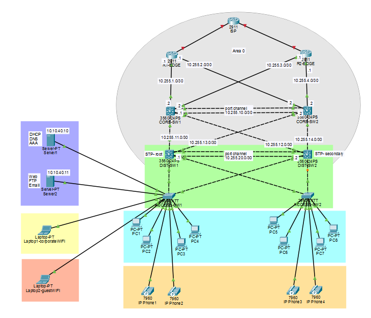

# Enterprise Network Infrastructure & High Availability Lab

A Cisco Packet Tracer enterprise network project designed to simulate a highly available corporate network infrastructure.

## Overview

This project implements a redundant enterprise network architecture consisting of:

- ISP Router
- Two Edge Routers
- Two Core Layer 3 Switches
- Two Distribution Switches
- Two Access Switches
- Server Infrastructure
- Corporate Users
- IP Phones
- Corporate Wi-Fi
- Guest Wi-Fi

## Network Topology

## Network Architecture

The network follows a hierarchical enterprise architecture with redundant infrastructure across the WAN, Core, Distribution, and Access layers.

### WAN / Internet Edge
- ISP Router
- Two redundant Edge Routers

### Core Layer
- CORE-SW1
- CORE-SW2
- Layer 3 routing
- OSPF
- Redundant paths

### Distribution Layer
- DIST-SW1
- DIST-SW2
- Inter-VLAN Routing
- HSRP
- ACLs
- DHCP Relay

### Access Layer
- ACCESS-SW1
- ACCESS-SW2
- VLAN-based segmentation
- Redundant uplinks
- STP
- Port Security

### Endpoints and Services
- Corporate PCs
- Cisco IP Phones
- Corporate Wi-Fi
- Guest Wi-Fi
- DHCP / DNS / AAA Server
- Web / FTP / Email Server
  
## Key Technologies

- VLANs
- Inter-VLAN Routing
- OSPF
- HSRP
- STP / PVST
- EtherChannel / LACP
- DHCP
- DNS
- AAA / TACACS+
- SSH
- ACLs
- Port Security
- DHCP Snooping
- Dynamic ARP Inspection
- Voice VLAN
- Guest Network Isolation

## High Availability

The network uses redundant Core, Distribution, and Edge devices.

HSRP provides redundant default gateways, while OSPF provides dynamic routing and redundant Layer 3 paths.

EtherChannel and redundant uplinks are also implemented to improve network availability and resilience.

## Network Services

The server infrastructure provides:

- DHCP
- DNS
- AAA / TACACS+
- HTTP
- FTP
- SMTP
- POP3

## Security

The project includes multiple security controls such as:

- SSH-based management
- AAA / TACACS+
- Port Security
- Sticky MAC
- BPDU Guard
- DHCP Snooping
- Dynamic ARP Inspection
- Guest Network Isolation
- Dedicated Management VLAN

## Testing

The implementation was verified through:

- OSPF neighbor verification
- HSRP failover testing
- EtherChannel verification
- VLAN and trunk verification
- DHCP testing
- DNS resolution
- Email testing
- IP Phone connectivity
- Guest network isolation
- Network security verification

## Tools

- Cisco Packet Tracer
- Cisco IOS

## Author

Wadha Alharbi

Computer Science and Engineering Graduate  
Network Engineering & IT Infrastructure
