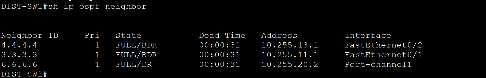
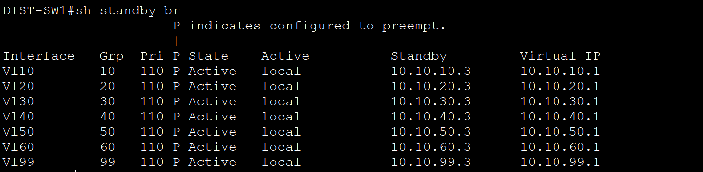
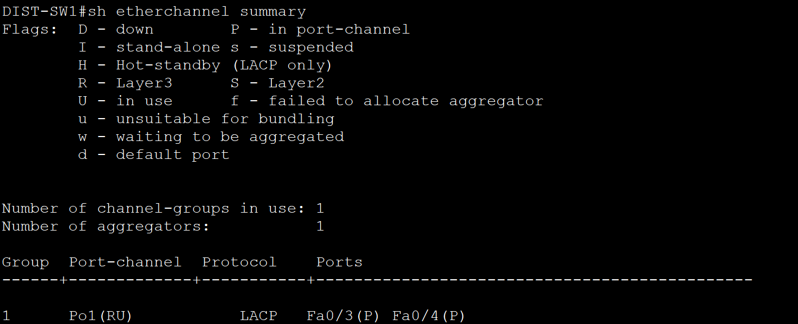
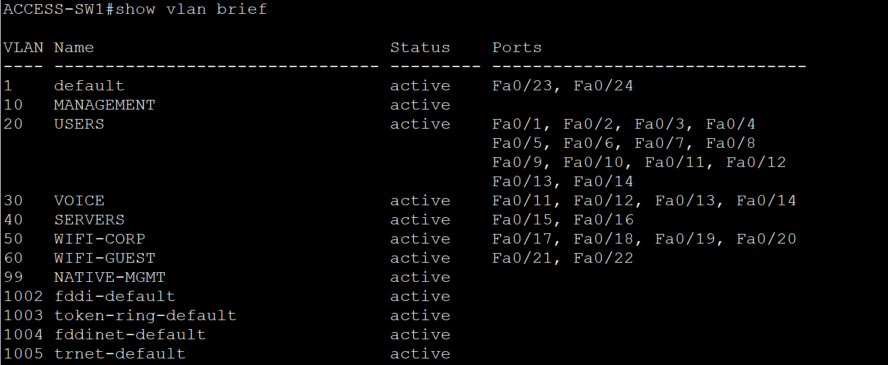
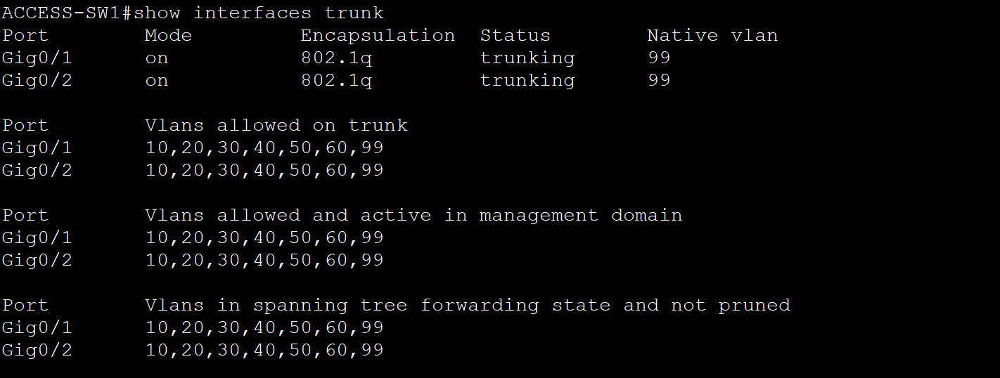
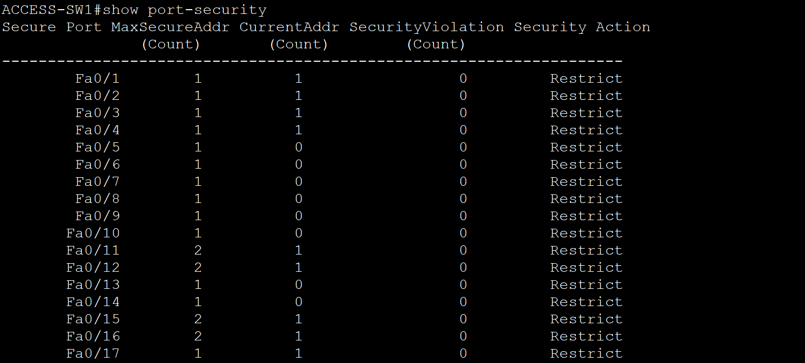
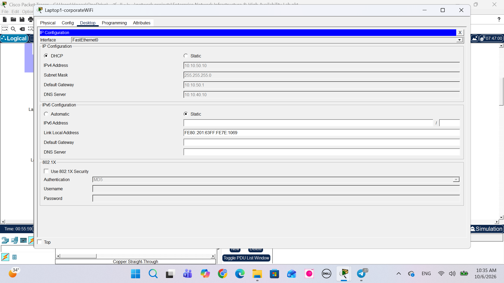
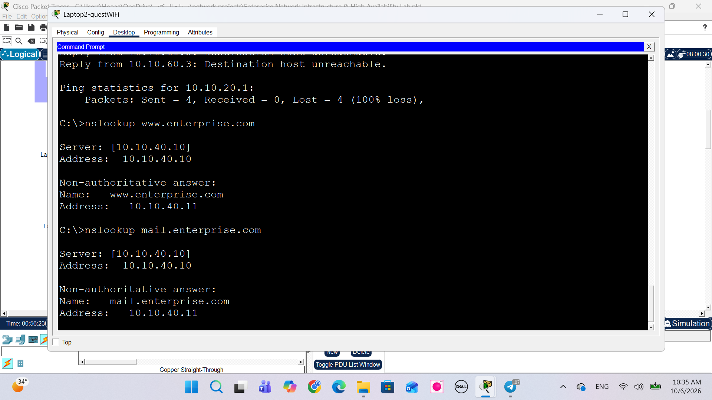
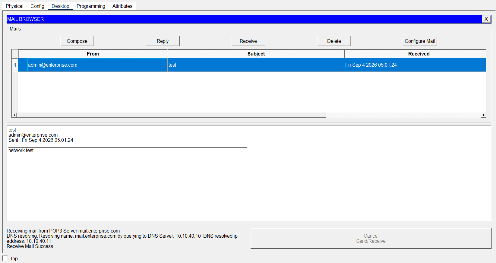
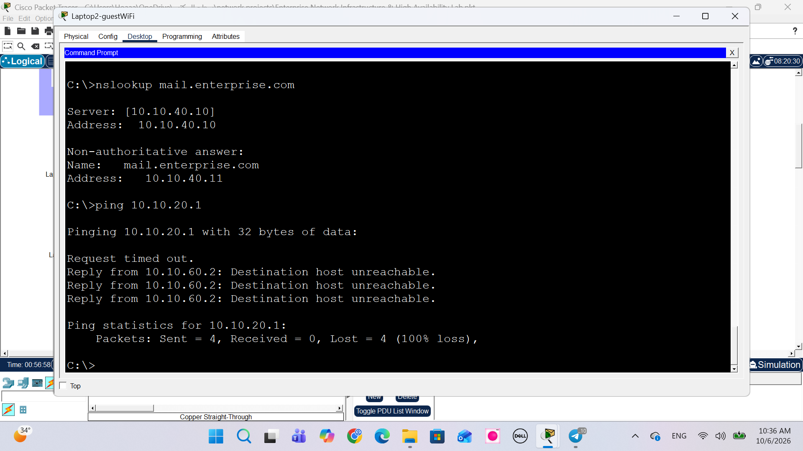

Enterprise Network Infrastructure & High Availability Lab

Cisco Packet Tracer | Routing & Switching | Network Security | High Availability

A hands-on enterprise network infrastructure project designed and implemented using Cisco Packet Tracer and Cisco IOS.

The lab simulates a corporate network environment with VLAN segmentation, OSPF dynamic routing, HSRP gateway redundancy, LACP EtherChannel, network services, Layer 2 security, and guest network isolation.

---

📌 Project Overview

This project focuses on designing and implementing a resilient enterprise network infrastructure with emphasis on:

- 🔄 High availability and redundancy
- 🌐 Routing and switching
- 🏷️ VLAN segmentation
- 🚦 OSPF dynamic routing
- 🛡️ HSRP gateway redundancy
- 🔗 LACP EtherChannel
- 🖥️ Enterprise network services
- 🔐 Layer 2 security
- 🚫 Guest network isolation
- 🧪 Network testing and verification

---

🏗️ Network Topology

The network follows a hierarchical enterprise design with redundant Layer 3 switching and segmented access networks.

  

Key Components

Layer| Components
Core / L3| Layer 3 switching, OSPF
Distribution| HSRP, Inter-VLAN Routing
Access| VLANs, Trunking, STP
Servers| DHCP, DNS, Web, Email
Security| Port Security, DHCP Snooping, DAI
Redundancy| HSRP, EtherChannel, OSPF

---

🔄 Routing — OSPF

OSPF is used as the dynamic routing protocol to provide communication between Layer 3 devices and redundant routing paths.

  

OSPF provides:

- Dynamic route exchange
- Automatic path selection
- Redundant Layer 3 paths
- Network convergence
- Scalable routing

OSPF neighbor relationships were verified to ensure correct operation of the routing infrastructure.

---

🛡️ High Availability — HSRP

HSRP provides default gateway redundancy for end devices.

  

The distribution switches operate as an active/standby gateway pair. If the active gateway becomes unavailable, the standby device can take over gateway responsibilities.

Benefits:

- Redundant default gateway
- Gateway failover
- Reduced single point of failure
- Improved network availability

---

🔗 EtherChannel / LACP

LACP EtherChannel combines multiple physical links into a single logical connection.

  

Benefits:

- Link redundancy
- Increased bandwidth
- Improved resiliency
- Simplified logical management

---

🌐 VLAN Segmentation

VLANs are used to logically separate different types of network traffic.

  

VLAN| Name| Purpose
10| MANAGEMENT| Network device management
20| USERS| Corporate users
30| VOICE| IP telephony
40| SERVERS| Server infrastructure
50| WIFI-CORP| Corporate wireless
60| WIFI-GUEST| Guest wireless
99| NATIVE-MGMT| Native / management traffic

VLAN segmentation improves network organization, traffic separation, security, and troubleshooting.

---

🔌 Trunking

802.1Q trunking is used to carry multiple VLANs across inter-switch links.

  

Trunk links allow multiple VLANs to traverse the same physical connection while maintaining logical network segmentation.

---

🔐 Network Security

Security controls were implemented at both the management and Layer 2 levels.

  

Security Controls

- SSH
- Local authentication
- Port Security
- Sticky MAC
- BPDU Guard
- DHCP Snooping
- Dynamic ARP Inspection
- VLAN segmentation
- Guest network isolation

These controls help protect the switching infrastructure and reduce unauthorized access.

---

🛡️ DHCP Snooping

DHCP Snooping was implemented to help protect clients from unauthorized DHCP servers.

  

Protection against:

- Rogue DHCP servers
- Unauthorized DHCP responses
- DHCP-based attacks

---

📡 DHCP

DHCP provides automatic IP address assignment to network clients.

  

The DHCP configuration was tested to verify automatic network configuration for clients.

---

🌎 DNS

DNS provides hostname resolution for internal network services.

  

DNS was configured to allow clients to resolve internal hosts and services.

---

🌐 Web Service

A web server was configured to simulate an internal enterprise application.

  

The service was tested to verify application-level connectivity across the network.

---

📧 Email Service

An email service was configured to simulate internal enterprise communication.

  

Email connectivity was tested between network clients and the mail server.

---

🚫 Guest Network Isolation

The guest network is logically separated from corporate resources using VLAN segmentation and access controls.

  

Objective

Guest devices should have access only to permitted network services while remaining isolated from internal corporate resources.

This demonstrates the practical use of network segmentation and traffic isolation in an enterprise environment.

---

🧪 Testing & Verification

The network was verified through configuration checks and connectivity testing.

Routing

- OSPF neighbor verification
- Routing table verification
- End-to-end connectivity
- Redundant path verification

Switching

- VLAN verification
- Trunk verification
- EtherChannel verification
- STP verification

High Availability

- HSRP status verification
- Gateway failover
- Redundant path testing

Network Services

- DHCP address assignment
- DNS resolution
- Web connectivity
- Email connectivity

Security

- DHCP Snooping verification
- Layer 2 security configuration
- Guest network isolation

---

📊 High Availability Design

Area| Implementation
Dynamic Routing| OSPF
Default Gateway Redundancy| HSRP
Link Redundancy| LACP EtherChannel
Loop Prevention| STP
Network Segmentation| VLANs
Secure Management| SSH
Layer 2 Protection| Port Security / DHCP Snooping
Guest Isolation| VLAN Segmentation

---

🛠️ Technologies & Tools

Networking

"Cisco Packet Tracer" · "Cisco IOS" · "VLANs" · "802.1Q" · "Inter-VLAN Routing" · "OSPF" · "HSRP" · "STP" · "EtherChannel / LACP"

Network Services

"DHCP" · "DNS" · "Web" · "Email"

Security

"SSH" · "Port Security" · "Sticky MAC" · "BPDU Guard" · "DHCP Snooping" · "Dynamic ARP Inspection" · "Network Segmentation"

---

🎯 Key Learning Outcomes

Through this project, I gained practical experience in:

- Designing enterprise network architectures
- Configuring Layer 2 and Layer 3 switching
- Implementing VLAN segmentation
- Configuring 802.1Q trunking
- Implementing OSPF dynamic routing
- Configuring HSRP gateway redundancy
- Implementing LACP EtherChannel
- Configuring DHCP and DNS services
- Applying Layer 2 security controls
- Isolating guest network traffic
- Troubleshooting routing and switching
- Verifying network redundancy and connectivity
- Documenting network infrastructure

---

📂 Repository Structure

enterprise-network-infrastructure-high-availability-lab/
│
├── documentation/
│
├── screenshots/
│   ├── 01-topology.png
│   ├── 02-ospf-neighbors.png
│   ├── 03-hsrp.png
│   ├── 04-etherchannel.png
│   ├── 05-vlans.png
│   ├── 06-trunks.png
│   ├── 07-security.png
│   ├── 08-dhcp snooping.png
│   ├── 09-dhcp.png
│   ├── 10-dns.png
│   ├── 11-web.png
│   ├── 12-email.png
│   └── 13-guest-isolation.png
│
├── Enterprise Network Infrastructure High Availability.pkt
│
└── README.md

---

📄 Packet Tracer Project

"Open Cisco Packet Tracer Project →" (./Enterprise%20Network%20Infrastructure%20High%20Availability.pkt)

---

👩‍💻 Author

Wadha Alharbi

Computer Science & Engineering Graduate
Network Engineering & IT Infrastructure

"Network Engineering" · "Network Operations" · "Routing & Switching" · "IT Infrastructure" · "Network Automation"

Connect:
"LinkedIn" (https://linkedin.com/in/wadha-alharbi) · "GitHub" (https://github.com/wadhaharbi)

---

⭐ Project Focus

«Design → Configure → Secure → Troubleshoot → Verify»

This project demonstrates practical application of enterprise networking concepts with a focus on routing & switching, network infrastructure, high availability, network security, and resilient network design.
